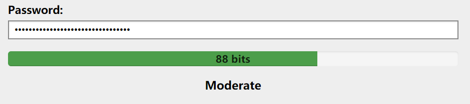

# PasswordQuality

A JavaScript library that uses an advanced algorithm for estimating the quality/strength of passwords.



## How to Use

#### For Browser

Add js script to your html file.

```html
<script src="./PasswordQuality.js"></script>

<!-- [ optional ] list of about 10000 most common passwords, 86kb (gzip 32kb)  -->
<script src="./MostPopularPasswords.js"></script>
```

Calculate the security quality of passwords.

```js
PasswordQuality('you password here');
// return the security quality of passwords.
```

#### For Node.JS, Webpack...

First download from npm.

```shell
npm install --save password-quality
```

Import and initialize the library.

```js
import PasswordQuality from 'password-quality';

// [ optional ] list of about 10000 most common passwords, 86kb (gzip 32kb)
import MostPopularPasswords from 'password-quality/dist/MostPopularPasswords'

// Load the popular passwords list
PasswordQuality.PopularPasswords.load(MostPopularPasswords)
```

Calculate the security quality of passwords.

```js
PasswordQuality('you password here');
// return the security quality of passwords.
```

## Algorithm from KeePass

> KeePass uses an advanced algorithm for estimating the quality/strength of passwords. It searches for patterns, like e.g. popular passwords (based on a built-in list of about 10000 most common passwords; variations by upper-/lower-case and L33t substitutions are detected), repeated sequences, numbers (consisting of multiple digits), constant difference sequences, etc. For each pattern combination covering the whole password, the cost (number of bits required to encode the data and the order of the pattern identifiers) is calculated. For encoding pattern identifiers, an optimal static entropy encoder is used. Each single password character forms a pattern of length 1 and is encoded using a character space-dependent damped static entropy encoder. The minimum pattern combination cost is used as the final quality estimation.
> 
> | Bits    | Strength    |
> |--------:|:------------|
> | 0-64    | Very weak   |
> | 64-80 	| Weak        |
> | 80-112  | Moderate    |
> | 112-128 | Strong      |
> | ≥ 128   | Very strong |
>
> https://keepass.info/help/kb/pw_quality_est.html